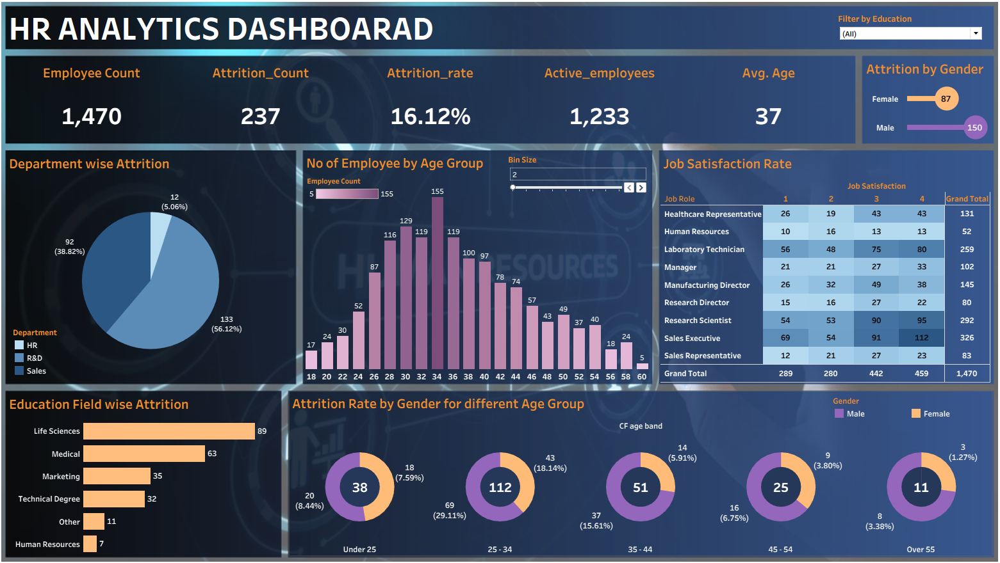

<h1 align="center">HR Analytics Dashboard</h1>

<p align="center">
A Data Visualization Project built using Tableau to analyze workforce data, employee attrition, and HR insights.
</p>

<p align="center">


</p>

---

# Project Overview

This project presents an **HR Analytics Dashboard** developed using **Tableau** to analyze employee data and generate insights related to workforce demographics, attrition trends, and job satisfaction levels.

The dashboard enables HR teams and decision-makers to explore employee patterns, monitor attrition rates, and understand workforce distribution across departments, education fields, and age groups.

The primary goal of this project is to demonstrate **data visualization, business intelligence, and analytical storytelling skills** by transforming raw HR data into meaningful and interactive visual insights.

---

# Dashboard Preview



---

# Key Metrics

| Metric | Value |
|------|------|
| Employee Count | 1,470 |
| Attrition Count | 237 |
| Attrition Rate | 16.12% |
| Active Employees | 1,233 |
| Average Age | 37 |

---

# Dashboard Features

## Employee Overview
- Total employees in the organization
- Active employees
- Employee attrition count
- Attrition rate
- Average employee age

## Department-wise Attrition
- Analysis of employee attrition across departments
- Departments include:
  - Human Resources
  - Research & Development
  - Sales

## Employee Age Distribution
- Histogram showing employee distribution across various age groups
- Helps analyze workforce demographics

## Job Satisfaction Analysis
- Job satisfaction levels across different job roles
- Identifies employee engagement trends

## Education Field-wise Attrition
- Attrition analysis based on employee educational backgrounds
- Fields include:
  - Life Sciences
  - Medical
  - Marketing
  - Technical Degree
  - Human Resources

## Gender-based Attrition Analysis
- Comparison of attrition between male and female employees
- Age-group level attrition insights

## Interactive Filters
Users can interact with the dashboard using:

- Education Field filter

This allows deeper exploration of HR data.

---

# Project Structure

```
hr-analytics-tableau-dashboard
│
├── data
│   └── HR_Data.xlsx
│
├── dashboard
│   └── HR_Analytics_Dashboard.twbx
│
├── images
│   ├── dashboard_preview.png
│   └── background.png
│
└── README.md
```

---

# Dataset

The dataset used in this project contains HR-related employee information including:

- Employee demographics
- Department details
- Education field
- Job roles
- Attrition status
- Age distribution
- Job satisfaction levels

The dataset is provided in **Excel format** and serves as the primary data source for building the Tableau dashboard.

---

# Tools & Technologies

- Tableau – Data Visualization and Dashboard Development
- Microsoft Excel – Data Source and Data Preparation
- GitHub – Project Hosting and Version Control

---

# Insights Derived from the Dashboard

Key observations from the analysis include:

- The organization has an **attrition rate of 16.12%**, indicating employee turnover that may require HR attention.
- **Research & Development** appears to have the largest employee population.
- Certain **education fields show higher attrition trends**, suggesting possible workforce challenges.
- **Job satisfaction varies significantly across roles**, which can influence retention strategies.
- Workforce age distribution highlights the dominant employee age groups.

---

# How to Use the Dashboard

1. Clone or download this repository.
2. Open the dashboard file:

```
dashboard/HR_Analytics_Dashboard.twbx
```

3. Launch it using **Tableau Desktop**.
4. Explore the dashboard and use filters to analyze HR insights.

---

# Future Improvements

Possible enhancements for this project include:

- Predictive analytics for employee attrition
- Additional HR KPIs such as salary distribution and performance metrics
- Publishing the dashboard on Tableau Public
- Adding automated data refresh

---

# Author

**Vaibhav Badiger**

LinkedIn  
https://www.linkedin.com/in/vaibhav-n-badiger

GitHub  
https://github.com/VaibhavNB

---

# License

This project is created for **learning and portfolio purposes**.
